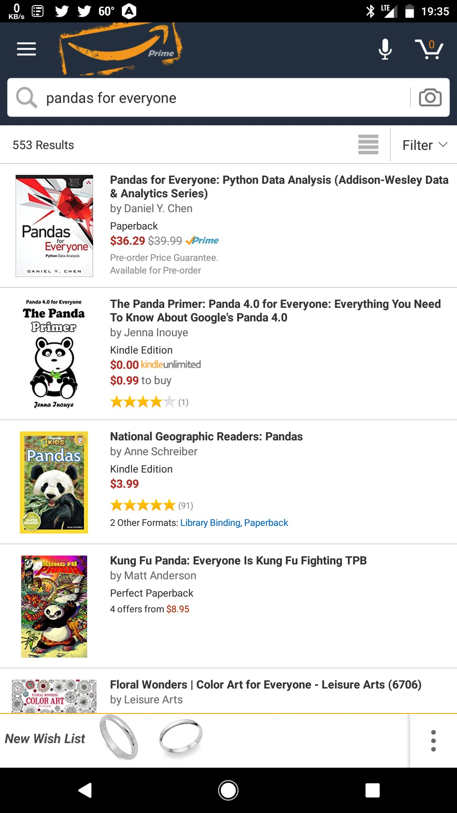
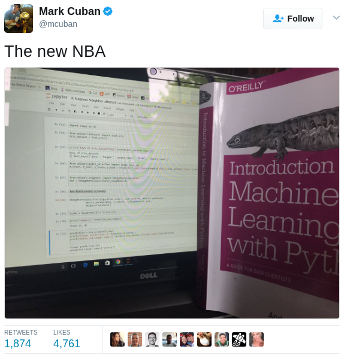
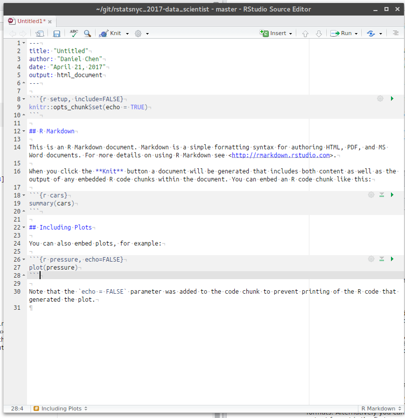
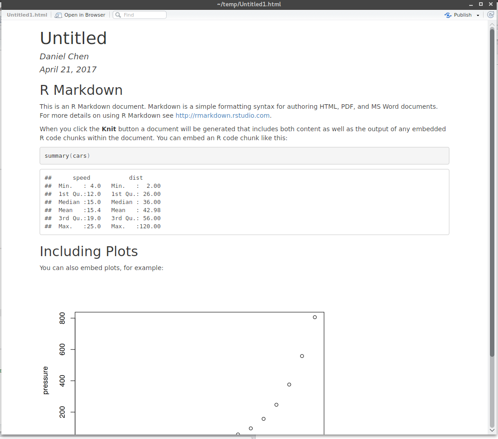
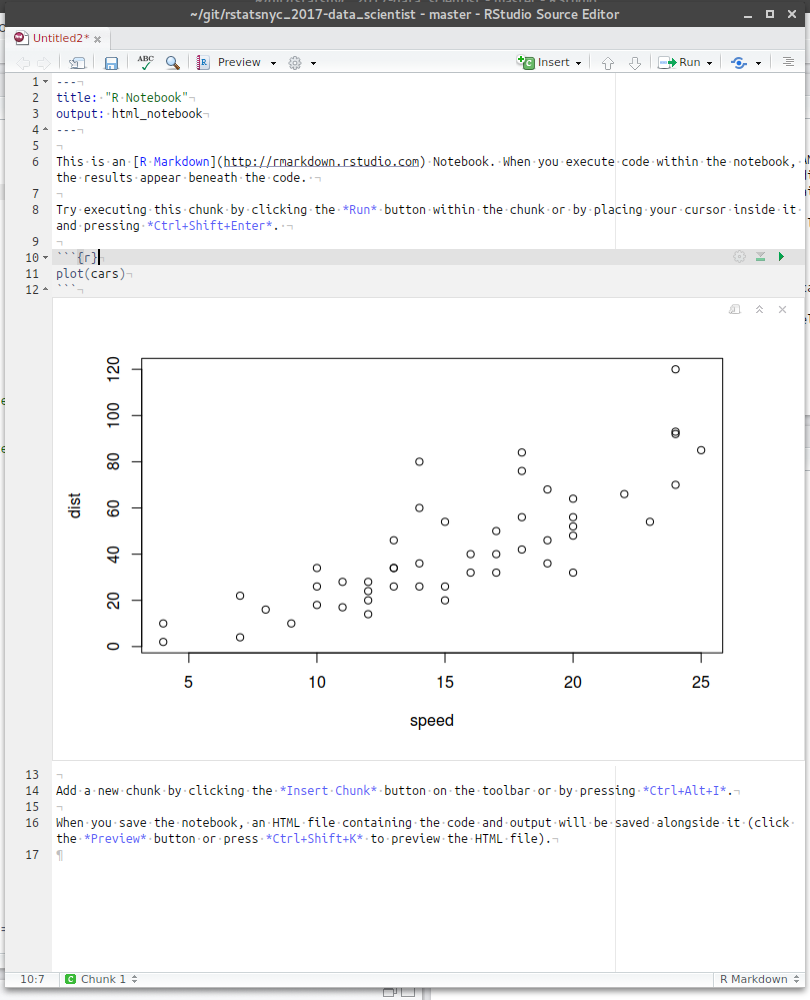
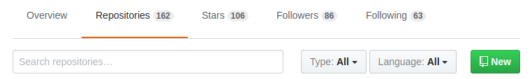
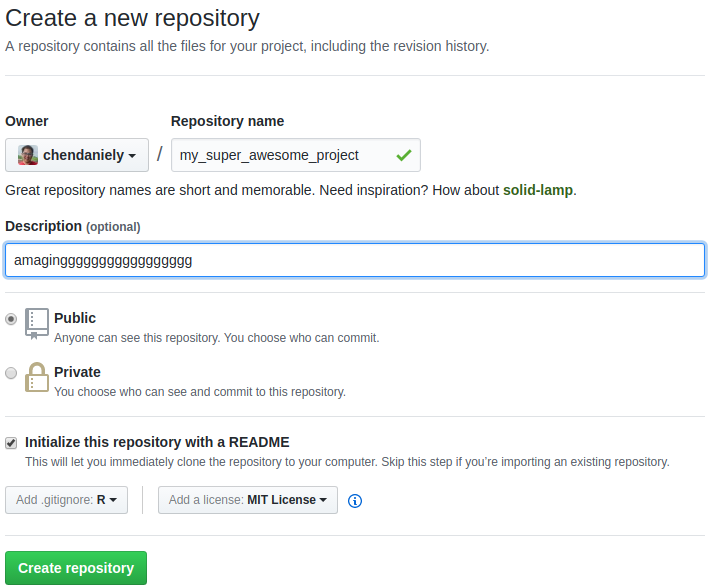
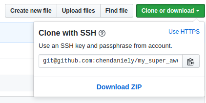

```{r setup, include=FALSE}
knitr::opts_chunk$set(echo = FALSE)
```

<style>
.column-left3{
  float: left;
  width: 33%;
  text-align: left;
}
.column-center3{
  display: inline-block;
  width: 33%;
  text-align: center;
}
.column-right3{
  float: right;
  width: 33%;
  text-align: right;
}
.column-left2{
  float: left;
  width: 50%;
  text-align: left;
}
.column-right2{
  float: right;
  width: 50%;
  text-align: left;
}

#topright {
    position: absolute;
    right: 0;
    top: 0;
    display: block;
    background: url(TRbanner.gif) no-repeat;
    text-indent: -999em;
    text-decoration: none;
}
</style>

## Brought to you by

<center>
 
<br>
MICHAEL KANE
</center>

## and...

<center>

<br>
AARON HALL
</center>
## Hi

Daniel Chen

- PhD Student at Virginia Tech
    - Genetics, Bioinformatics, and Computational Biology ([GBCB][1])
    - [Biocomplexity Institute][2] of Virginia Tech
- Social and Decision Analytics Laboratory ([SDAL][3])

- [Lander Analytics][11]


## Teach

<div class="column-left2">
- [Software Carpentry][4]
    - Maintain: [Programming with R][17]
    - [R for Reproducible Scientific Analysis][18]
- [Data Carpentry][5]
- Data Science for the Public Good ([DSPG][6])
- [Git Essentials][7]
- [Cleaning Data in Python][8] ([DataCamp][9])
- [Pandas for Everyone][10]
</div>
<div class="column-right2">

</div>

## Royal Quiet De Luxe

<center>

</center>

## Data Science is Accessable!

<center>

</center>

## Tools and skills needed to be a Data Scientist

- Bash
- (R)markdown
- Git
- SQL
- Make

# Project Templates

## Project Templates

What do your projects look like?

- Dump all files into the same folder!

Why project templates?

- Gives you some kind of standard folder structure
- Easy to share and collaborate
- Yourself... hours/days/weeks/months/years from now

## Project Templates

- Noble 2009: A Quick Guide to Organizing Computational Biology Projects
    - http://journals.plos.org/ploscompbiol/article?id=10.1371/journal.pcbi.1000424
- Jenny Bryan: [rr-init][12]
- Daniel Chen: [computational-project-cookie-cutter][13]

- [John Myles White][14]: [Project][15] [Templates][16]

- Adapt your own!

## Noble 2009: Figure 1. Directory structure for a sample project


# Bash

## Bash (Shell)

- You have your folder structure
- How do you run your code?
- "Cloud"
    - How do you get to your code?

## Basic Commands

- `whoami`: current user
- `pwd`: where am i?
- `ls`: list what's here
- `cd`: change directory to there
- `mkdir my_folder`: make a folder here named my_folder
- `nano`, `vi`, `vim`, `emacs`: some terminal text editors
- `RScript my_script.R`: run your R script

## Initial take away

- What a working directory is: `pwd`
- How to navigate the filesystem :`..`
- How to run programs

SWC: Functions do one task and do it well

## SSH

- Connects to the "cloud"
- `ssh server_name`
- `ssh -L 8787:localhost:8787 rstudio_server`
- `ssh -L 8888:localhost:8888 jupyter_notebook`
- `ssh -L myport:localhost:remote server`

## Create SSH Keys

```
ssh-keygen
cd ~/.ssh
cat id_rsa.pub
```

# (R)markdown

## R

- Do your analytics in a programming language
- Reproducible
- Dataset updates
- Documents your process
    - Directly manipulating your data
- Testing your data
    - [RStatsNYC 2016][19]

## Installing R

## How I bypass IT

## How I bypass IT

- Use anaconda!
- https://www.continuum.io/downloads
- Installs things under local user... which you have permisison to change!

- `conda install r r-essentials`
    - https://conda.io/docs/r-with-conda.html

- Mileage may vary

## RMarkdown

- "the last mile" - Jupyter
- Literate Programming
- Having your analysis, output, with prose text interpretations
- Reports
- Dashboards (flexdashboard)

## RMarkdown Source

<center>

</center>

## RMarkdown Output

<center>

</center>

## R Notebooks

- Jupyter Notebooks

> "An R Notebook is an R Markdown document with chunks that can be executed independently and interactively, with output visible immediately beneath the input."

> "Any R Markdown document can be used as a notebook, and all R Notebooks can be rendered to other R Markdown document types..."
 
## R Notebook output

<center>

</center>

## Markdown

<div class="column-left2">
```
*italic*

**bold**

- bullet 1
- bullet 2
    - sub-bullet 1

1. list 1
2. list 2
1. list 3


[rstatsnyc](http://www.rstats.nyc/)
```
</div>

<div class="column-right2">
*italic*

**bold**

- bullet 1
- bullet 2
    - sub-bullet 1

1. list 1
2. list 2
1. list 3

[rstatsnyc](http://www.rstats.nyc/)
</div>

## Rendering RMarkdown Documents

- `rmarkdown::render()`

```r
render(input, output_format = NULL, output_file = NULL, output_dir = NULL,
       output_options = NULL, intermediates_dir = NULL,
       knit_root_dir = NULL,
       runtime = c("auto", "static", "shiny", "shiny_prerendered"),
       clean = TRUE, params = NULL, knit_meta = NULL, envir = parent.frame(),
       run_pandoc = TRUE, quiet = FALSE, encoding = getOption("encoding"))
```

## Somewhat annoyting knitr button

https://github.com/chendaniely/rendR

## R

- load your data: `readxl`, `haven`, `readr`, `read.csv`?
- `apply` family
- tidyverse: `tidyr`, `dplyr`, `purrr`,  ..., `install.packages("tidyverse")`
    - http://tidyverse.org/
- Broom
    - David Robinson
    - 2016 New York R Conference
    - Broom: Converting Statistical Models to Tidy Data Frames
    - https://www.youtube.com/watch?v=7VGPUBWGv6g&feature=youtu.be
- vignettes!

- Software Carpentry and Data Carpentry Lessons

- Do one thing in R, save it out, and proceed with your usual pipeline

## R

```
dat <- c(1, 2, 3, 4, 5, 6, 7, 8, 9)
mat <- matrix(data = dat, nrow = 3, ncol = 3)
mat
write.csv(x = mat, file = 'my_data.csv')
```

# Git

## Git solves...

<center>

</center>

## tl;dr

- `git init`
    - turns the current folder into a git repo(sitory)
    - **DO NOT** type this in a subfolder
- `git add final.doc`
    - adds final.doc to the 'staging area'
- `git commit -m 'add final.doc'`
    - commit/save final.doc with the message 'add final.doc'
- `git add .; git commit -m 'a useful message!'`

## Need more backups: remotes

Anywhere that's not where you typed `git init`

- `git push origin master`
- `put pull origin master`

## Creating a Github Remote




## Naming the remote

<center>

</center>

## Adding a remote

`git remote add origin URL`

<center>

</center>

## Empty folders

- git only tracks folders with things in it
- empty folers, `output`, won't be in the repo
- `touch output/.gitkeep`
- `git add .gitkeep`
- `git commit -m 'created output folder'`

# SQL

## SQL

- Structured Query Language
- Databases
- Data cannot be CSV'ed around
- Too big for memory

## SQL Example

```SQL
SELECT * FROM my_data;

SELECT col1, col2 FROM my_data;

SELECT col1,col2 FROM my_data WHERE col3 > 0;

SELECT Orders.OrderID, Customers.CustomerName, Orders.OrderDate
FROM Orders
INNER JOIN Customers ON Orders.CustomerID=Customers.CustomerID;
```

## SQL in R

```r
library(RPostgreSQL) 
drv <- dbDriver("PostgreSQL")
con <- dbConnect(drv, dbname="my_databsae", host="localhost", port=5432,
                 user="dan", password="rstatsnyc")

```

```{r, echo=TRUE}
q <- sprintf('SELECT %s FROM %s;',
             '*',
             'my_table')
q
```

## RUN SQL in R

```
library(RPostgreSQL) 
drv <- dbDriver("PostgreSQL")
con <- dbConnect(drv, dbname="my_databsae", host="localhost", port=5432,
                 user="dan", password="rstatsnyc")

q <- sprintf('SELECT %s FROM %s;',
             '*',
             'my_table')

df <- dbGetQuery(con, q)
```

## dplyr

```{r, echo=TRUE, message=FALSE}
library(ggplot2)
library(dplyr)

diamonds %>%
    group_by(cut) %>%
    summarize(ave = mean(carat))
```

## dplyr with SQL

```
diamonds_db_con %>%
    group_by(cut) %>%
    summarize(ave = mean(carat))
```

# Make

## Make... what?

- allows you to assign dependencies in source code
- `source('my_file.R')
- only executes the out-of-date code/commands

## 01-make_data.R

```r
library(ggplot2)
library(dplyr)

df <- diamonds %>%
    group_by(cut) %>%
    summarize(avg = mean(carat))

write.csv(df, file = 'output/grouped_diamonds.csv')
```

## 02-make_plot.R

```r
library(readr)
library(ggplot2)

df <- read_csv('output/grouped_diamonds.csv')

ggplot(data = df, aes(x = cut, y = avg)) + geom_bar(stat = 'identity')
ggsave('output/avg_carat_by_cut.png')
```

## Makefile

```
output/grouped_diamonds.csv : src/01-make_data.R
	Rscript src/01-make_data.R

output/avg_carat_by_cut.png: output/grouped_diamonds.csv
	Rscript src/02-make_plot.R

.PHONY : clean
clean :
	rm -f output/*

.PHONY : plots
plots : output/avg_carat_by_cut.png`
```

## Make it!

```
$ make plots
Rscript src/01-make_data.R

Attaching package: ‘dplyr’

The following objects are masked from ‘package:stats’:

    filter, lag

The following objects are masked from ‘package:base’:

    intersect, setdiff, setequal, union

Rscript src/02-make_plot.R
Parsed with column specification:
cols(
  X1 = col_integer(),
  cut = col_character(),
  avg = col_double()
)
Warning message:
Missing column names filled in: 'X1' [1] 
Saving 7 x 7 in image

```

## Make it again!

```
$ make plots
make: Nothing to be done for 'plots'.
```

## Looking forward

- "Data Science" Class
- Scientific Data Analyst

## Thanks!

- http://chendaniely.github.io/
- @chendaniely
- https://github.com/chendaniely/rstatsnyc_2017-data_scientist

[1]: http://gbcb.vbi.vt.edu/
[2]: https://www.bi.vt.edu/
[3]: https://www.bi.vt.edu/sdal
[4]: https://software-carpentry.org/
[5]: http://www.datacarpentry.org/
[6]: https://www.bi.vt.edu/sdal/projects/data-science-for-the-public-good-program
[7]: https://www.safaribooksonline.com/library/view/git-essentials-livelessons/9780134655284/
[8]: https://www.datacamp.com/courses/cleaning-data-in-python
[9]: https://www.datacamp.com/
[10]: https://www.safaribooksonline.com/library/view/pandas-for-everyone/9780134547046/
[11]: http://www.landeranalytics.com/
[12]: https://github.com/Reproducible-Science-Curriculum/rr-init
[13]: https://github.com/chendaniely/computational-project-cookie-cutter
[14]: http://www.johnmyleswhite.com/notebook/2010/08/26/projecttemplate/
[15]: https://github.com/johnmyleswhite/ProjectTemplate
[16]: https://cran.r-project.org/web/packages/ProjectTemplate/index.html
[17]: https://swcarpentry.github.io/r-novice-inflammation/
[18]: https://swcarpentry.github.io/r-novice-gapminder/
[19]: https://www.youtube.com/watch?v=CAy0udiWwmg
